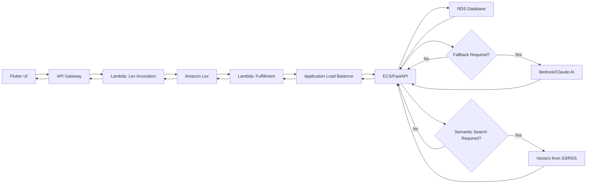

# AWS Services Overview and Implementation with Terraform & Scalr

## **Week 1: Exploring AWS Services**

This document provides an overview of the AWS services explored during Week 1 and their implementation using **Terraform** and **Scalr** in Week 2.

## **AWS Services Overview**

### **1. AWS S3 (Simple Storage Service)**
#### Overview:
Amazon S3 is a scalable, secure, and durable object storage service that allows you to store and retrieve data from anywhere on the internet. It provides industry-leading scalability, data availability, security, and performance. S3 stores data as objects within buckets and is ideal for a wide variety of applications, including big data analytics, backup and restore, archiving, and data lakes.

#### Key Features:
- Scalable storage with high durability (99.999999999%).
- Supports versioning, encryption, and access control.
- Can serve as a data lake for analytics.

#### Use Cases:
- Storing static files and website hosting.
- Data backup and archival.
- Logging and analytics.

---

### **2. AWS IAM (Identity and Access Management)**
#### Overview:
AWS IAM is a global security service that helps you manage users, groups, roles, and permissions for controlling access to AWS services and resources. It enforces least privilege access through fine-grained access control.

#### Key Features:
- Fine-grained access control via policies.
- Role-based access control (RBAC) for services and users.
- Supports Multi-Factor Authentication (MFA).

#### Use Cases:
- Controlling access to AWS resources.
- Creating IAM roles for secure EC2-S3 interactions.
- Applying security best practices in cloud environments.

---

### **3. AWS RDS (Relational Database Service)**
#### Overview:
Amazon RDS is a fully managed relational database service that supports multiple database engines, including MySQL, PostgreSQL, Oracle, SQL Server, and Amazon Aurora. It simplifies database management tasks like provisioning, patching, backups, and scaling.

#### Key Features:
- Automated backups and patching.
- Multi-AZ high availability.
- Read replicas for scalability.

#### Use Cases:
- Hosting relational databases for applications.
- Creating disaster recovery solutions.
- Scaling database workloads efficiently.

---

### **4. AWS Athena**
#### Overview:
Amazon Athena is a serverless, interactive query service that allows you to run SQL queries directly on data stored in Amazon S3. It uses Presto and Trino as its query engines and does not require infrastructure management.

#### Key Features:
- Pay-as-you-go pricing based on queries.
- Uses Presto SQL for analytics.
- Integrates with AWS Glue for schema discovery.

#### Use Cases:
- Running ad-hoc SQL queries on large datasets.
- Log analysis from S3 data.
- Business intelligence and reporting.

---

### **5. AWS Lambda**
#### Overview:
AWS Lambda is a serverless, event-driven compute service that allows you to run code without provisioning or managing servers. Lambda executes your code in response to triggers like S3 events, DynamoDB streams, or HTTP requests via API Gateway.

#### Key Features:
- Runs code without provisioning servers.
- Supports multiple languages (Python, Node.js, Java, etc.).
- Can be triggered by API Gateway, S3, DynamoDB, and more.

#### Use Cases:
- Event-driven processing (e.g., S3 file processing).
- Building RESTful APIs with API Gateway.
- Automating cloud operations.

---

### **6. AWS ECS (Elastic Container Service)**
#### Overview:
Amazon ECS is a fully managed container orchestration service that helps deploy, manage, and scale containerized applications. ECS supports Docker containers and can run on EC2 instances or AWS Fargate.

#### Key Features:
- Supports Fargate (serverless) and EC2 launch types.
- Integrated with AWS IAM for security.
- Load balancer and auto-scaling support.

#### Use Cases:
- Deploying microservices applications.
- Running batch processing workloads.
- Hosting scalable APIs in containers.

---

### **7. AWS Glue Catalog**
#### Overview:
AWS Glue Data Catalog is a centralized metadata repository that automatically discovers, catalogs, and manages metadata for datasets across AWS services. It acts as a catalog for Athena, Redshift Spectrum, and EMR.

#### Key Features:
- Automatically catalogs metadata for S3 data.
- Serverless ETL job execution.
- Integration with Athena, Redshift, and RDS.

#### Use Cases:
- Building a data lake architecture.
- Automating schema discovery for structured datasets.
- Preparing data for analytics pipelines.

---

### **8. AWS QuickSight**
#### Overview:
Amazon QuickSight is a cloud-native business intelligence (BI) and data visualization service that helps you build interactive dashboards and reports from various data sources. It provides insights using machine learning-powered analytics.

#### Key Features:
- Supports data sources like Redshift, S3, and Athena.
- Machine learning insights and anomaly detection.
- Interactive dashboards and reporting.

#### Use Cases:
- Business intelligence and reporting.
- Visualizing AWS service logs and metrics.
- Building interactive dashboards for stakeholders.

---

### **9. AWS DMS (Database Migration Service)**
#### Overview:
AWS DMS is a fully managed service that migrates databases to AWS with minimal downtime. It supports homogeneous migrations (e.g., Oracle to Oracle) and heterogeneous migrations (e.g., MySQL to Aurora or SQL Server to PostgreSQL).

#### Key Features:
- Supports heterogeneous database migrations.
- Continuous data replication.
- Automatic monitoring and error handling.

#### Use Cases:
- Migrating on-prem databases to AWS.
- Setting up cross-region database replication.
- Upgrading database engines with minimal downtime.

---

### **10. AWS Redshift**
#### Overview:
Amazon Redshift is a fully managed cloud-based data warehouse designed for large-scale data analytics. It uses Massively Parallel Processing (MPP) to perform complex SQL queries across petabyte-scale datasets efficiently. Redshift stores data in a columnar format, which minimizes I/O and improves query performance.

#### Key Features:
- Columnar storage for high query performance.
- Massively parallel processing (MPP).
- Integrated with BI tools like QuickSight.

#### Use Cases:
- Running complex analytics on large datasets.
- Data warehousing for business intelligence.
- Storing and processing structured big data.

---

## **Week 2: Implementing AWS Services with Terraform and Scalr**

### **Infrastructure as Code (IaC) with Terraform**
Terraform is used to define AWS resources in code, enabling repeatable and automated infrastructure deployment.

### **Using Scalr for Terraform Automation**
Scalr provides governance and automation for Terraform workflows, ensuring compliance and centralized management.

### **Terraform Implementation for AWS Services**
Below are Terraform modules created for each AWS service:

#### **1. AWS S3 (Terraform Example)**
```hcl
resource "aws_s3_bucket" "my_bucket" {
  bucket = "my-unique-bucket-name"

  tags = {
    Name        = "My bucket"
    Environment = "Dev"
  }
}
```

#### **2. AWS IAM (Terraform Example)**
```hcl
resource "aws_iam_role" "iam_role" {
  name = "test-role"
  assume_role_policy = jsonencode({
    Version = "2012-10-17"
    Statement = [{
      Action = "sts:AssumeRole"
      Effect = "Allow"
      Principal = {
        Service = "ec2.amazonaws.com"
      }
    }]
  })
}
```

#### **3. AWS RDS (Terraform Example)**
```hcl
resource "aws_db_instance" "rds_instance" {
  identifier             = "test-rds-mysql"
  allocated_storage      = 20
  engine                 = "mysql"
  instance_class         = "db.t3.micro"
  username               = "admin"
  password               = "yourpassword"
  publicly_accessible    = true
}
```

Similar Terraform modules were implemented for **Athena, Lambda, ECS, Glue, QuickSight, DMS, and Redshift**.

### **Conclusion**
- Week 1: Explored AWS services and their key functionalities.
- Week 2: Implemented infrastructure using Terraform and Scalr for automation.

This project provided hands-on experience in AWS cloud automation, infrastructure as code, and governance with Scalr.

### Detailed Project Implementation and Structure

#### Week 3: Local Implementation

**Step 1: PostgreSQL Database (Local)**
- Installed PostgreSQL locally.
- Created database schema including necessary tables (e.g., company_registration, university, student_registration, etc.)
- Populated database with sample data for testing.

### Docker Container Setup
1. **Database Container:**
   - Used PostgreSQL Docker image for local development.
   - Configured Docker Compose to manage the database.

2. **FastAPI Container:**
   - Developed FastAPI backend with endpoints managing CRUD operations.
   - Created Dockerfile to containerize the FastAPI application.
   - Ensured connection between FastAPI and PostgreSQL using SQLAlchemy ORM.

### Local Chatbot Development
- Built initial chatbot logic locally using Amazon Lex SDK.
- Set up local integration and testing via local FastAPI endpoints.

#### Week 4: Cloud Deployment and Integration

### AWS Cloud Setup

#### 1. **Amazon RDS Database:**
   - Provisioned PostgreSQL database on AWS RDS.
   - Configured Security Groups to allow ECS connections.
   - Deployed database schema to RDS and migrated data.

#### 2. **ECS and ECR Setup:**
   - Built Docker image of FastAPI application and pushed it to Amazon ECR.
   - Created ECS Fargate task definition referencing ECR image.
   - Set environment variables in ECS task to connect to RDS database.

#### 2. **Amazon ECS Container:**
   - Configured ECS cluster and defined task definition for FastAPI.
   - Created ECS Fargate service with Application Load Balancer (ALB).
   - Verified FastAPI endpoints through ALB.

#### 3. **AWS Lambda Functions:**
   - Created Lambda functions:
     - **Lex Fulfillment Lambda:** Integrated with Lex to fetch data from FastAPI endpoints via ALB.
     - Managed error handling and responses to Lex.
   - Developed another Lambda function as an intermediary between Lex and the Flutter application.

#### 4. **Amazon Lex Integration:**
   - Defined Lex bot with specific intents like `GetStudentProfile`, `RecommendUniversity`, and more.
   - Linked Lex intents with Lambda fulfillment function for dynamic responses.

#### 5. **Flutter Integration via API Gateway:**
   - Created AWS API Gateway REST endpoint linked to Lambda proxy function.
   - Developed Lambda proxy to handle communication between Flutter and Lex.
   - Integrated Flutter app to communicate with Lex through API Gateway.

#### 6. **Bedrock and Claude AI (Fallback Intent):**
   - Integrated Bedrock and Claude AI for managing fallback intents when data is not in RDS.
   - Set up Lambda functions to handle fallback intent via Bedrock API calls.

#### 7. **Amazon S3 and Data Vectorization:**
   - Uploaded documents and files to Amazon S3.
   - Implemented Lambda function for vectorizing content stored in S3.
   - Stored vectorized data in RDS database.
   - Set up a retrieval mechanism for vectorized data when new queries are received.

#### **Detailed Project Overview (Step-by-Step)**:
## Step 1: User Interaction (Flutter UI)
- The process begins with the user interacting through the Flutter-based UI.
- The user sends queries or requests via the app interface.
## Step 2: API Gateway (Integration Point)
- User requests from Flutter are routed to AWS API Gateway.
- API Gateway forwards the user's message to an AWS Lambda function.
## Step 3: Lambda Function (Lex Invocation)
- A Lambda function triggered by API Gateway receives the input message.
- This Lambda function invokes Amazon Lex with the user's query, managing conversational flow and intent detection.
## Step 4: Amazon Lex (Conversational AI)
- Lex processes the incoming message to detect the intent and extract necessary information (slots) from the user input.
- Once the intent and required slots are identified, Lex calls another Lambda function (Fulfillment Lambda) for detailed information retrieval.
## Step 5: Fulfillment Lambda (Service Invocation)
- Lex triggers the fulfillment Lambda function, which processes the request based on the detected intent.
- The fulfillment Lambda function invokes FastAPI services running within Docker containers on ECS (Elastic Container Service) through an Application Load Balancer (ALB).
## Step 6: AWS ECS & Docker (FastAPI Backend)
- FastAPI application is hosted inside Docker containers managed by AWS ECS.
- FastAPI endpoints handle the requests coming from the fulfillment Lambda through ALB.
- These endpoints fetch or manipulate data stored within the PostgreSQL database hosted on AWS RDS.
## Step 7: Amazon RDS (Database Interaction)
- PostgreSQL database stores all structured application data, such as student profiles, university details, company registrations, and more.
- FastAPI endpoints retrieve data from this database according to user requests.
## Step 8: Fallback Mechanism with Bedrock and Claude AI
- If the requested data is not found within RDS, the system uses Amazon Bedrock integrated with Claude AI to generate a suitable fallback response.
- Bedrock assists in generating dynamic responses and ensures no query goes unanswered.
## Step 9: S3 and Vectorization
- Relevant documents or files stored in Amazon S3 are vectorized through a separate Lambda function.
- Vectorized data is stored back into the RDS database for efficient semantic retrieval.
## Step 10: Vectorized Data Retrieval (Semantic Search)
- If the query pertains to document-based information, the service queries the RDS for stored vectors.
- Semantic search retrieves the relevant data based on similarity between query vectors and stored vectors, ensuring efficient information retrieval.
## Step 11: Response Flow Back to the User
- FastAPI returns the final data or response back through the ALB to the fulfillment Lambda.
- Fulfillment Lambda packages this response, returning it to Lex, which then returns it to the initial Lambda function triggered by API Gateway.
- The response is finally returned from API Gateway back to the Flutter frontend, displaying the answer or requested information to the user.
  
**Summary of the Flow**:
Flutter UI → API Gateway → Lambda (Lex Invocation) → Amazon Lex → Lambda (Fulfillment) → ALB → ECS/FastAPI → RDS Database → (Fallback via Bedrock/Claude or Semantic Search via Vectors from S3 and RDS) → FastAPI → ALB → Lambda (Fulfillment) → Lex → Lambda (Lex Invocation) → API Gateway → Flutter UI
This architecture efficiently integrates multiple AWS services to create a robust, scalable, and intelligent conversational application.
# Project Flow Overview


**key takeaways**:

- *Cloud Services*: Gained proficiency in deploying applications using AWS ECS, ECR, RDS, Lambda, API Gateway, Lex, and S3, giving me comprehensive knowledge of scalable and reliable cloud solutions.
- *Containerization & Microservices*: Improved my skills in containerizing applications with Docker, effectively managing microservices, and orchestrating deployments via ECS and Fargate.
- *Serverless Computing*: Learned to build serverless applications using AWS Lambda, which streamlined development processes and enhanced scalability.
- *Conversational AI Integration*: Developed advanced capabilities by integrating chatbots with AWS Lex and enhancing responses using generative AI through Bedrock and Claude AI.
- *Database Management*: Developed expertise in designing, deploying, and managing PostgreSQL databases on Amazon RDS, including schema creation, data migrations, and secure access control through AWS security groups.
- *Serverless Computing*: Gained practical exposure to AWS Lambda functions, including integration with external services, handling serverless logic, and enhancing application responsiveness.
- *Debugging & Troubleshooting*: Improved your problem-solving abilities through debugging Lambda functions, API integrations, and ECS deployments, including working through real-world deployment challenges.
- *Comprehensive Development Workflow*: Experienced end-to-end project implementation.
